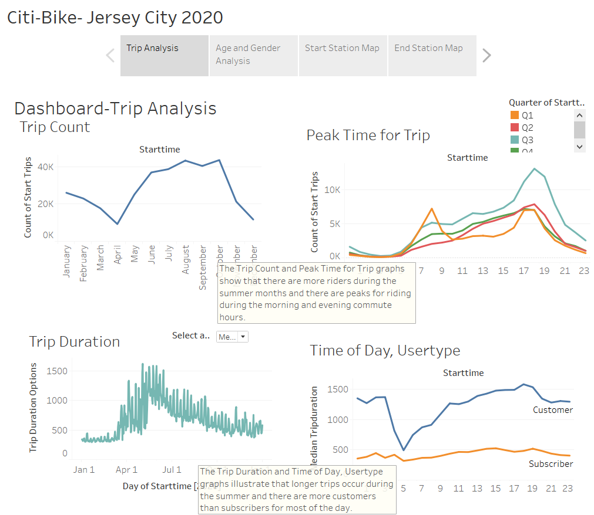
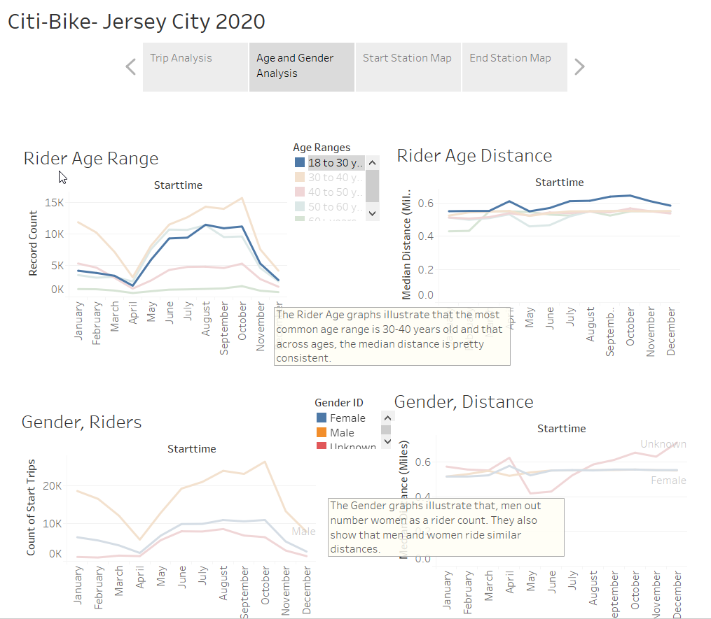
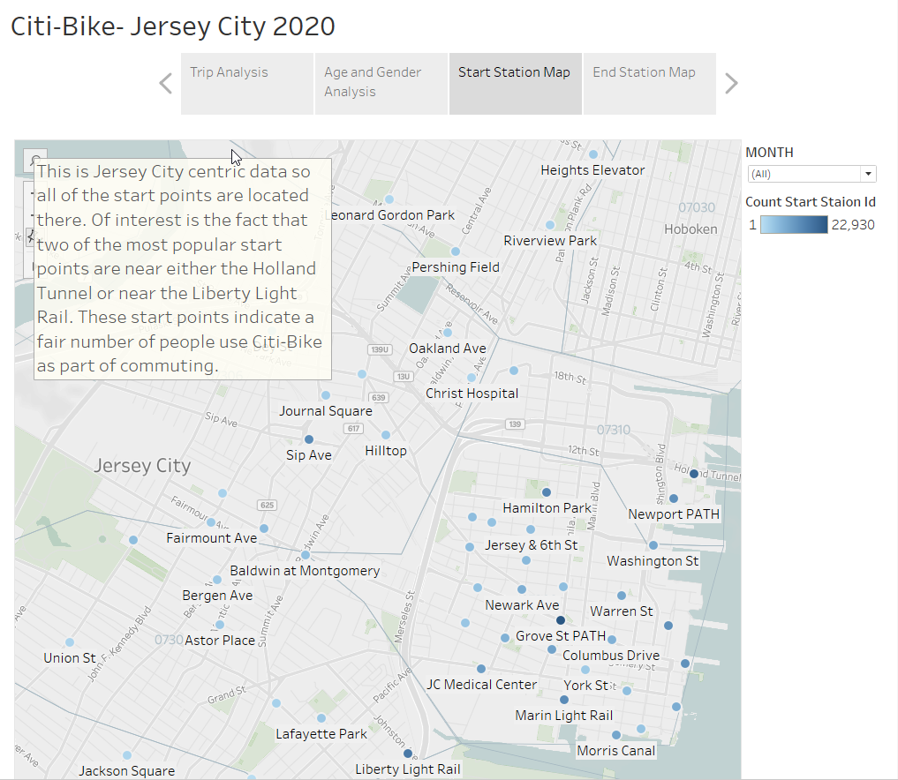
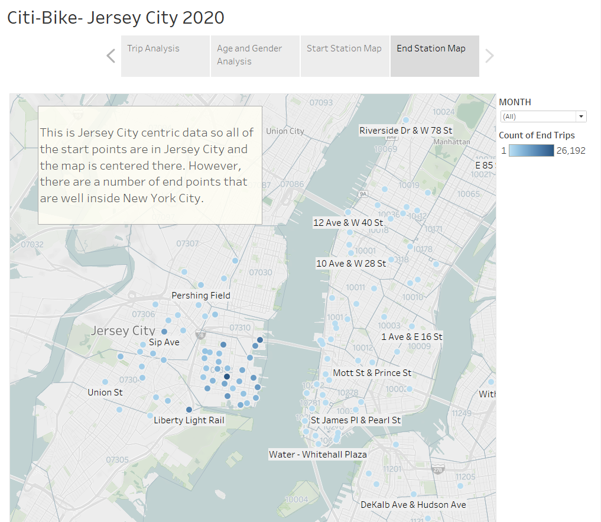

# Citi-Bike Jersey City 2020 Analysis

This is a combined python ETL along with Tableau Analysis Project. This analysis was broken up into two phases:

1. ETL Phase: The data, as provided, is broken up per month. I wanted a single csv file to present to Tableau so I used some loops in python to read in the data and concatenate it. I also used a function to add in a new field to the data, Distance (miles). The distance is calculated using the geopy.distance module. Calling distance.distance with two sets of latlng parameters returns the distance in miles between these two points of interest.
2. The second phase is the Tableau Data Visualization/Analysis phase. In this phase, I created a total of ten graphs, two dashboards, and one story that combined all of these visualizations and provided analysis for them in a story form.

## Trip Analysis

The idea here was to have four different visualization that relate directly to a when and how a trip occurs:

* Trip Count: counts the number of trips as they occur over the year. What we can see with this is that there are more trips during the summer months.
* Peak Time for Trip: this graph plots the trips taken versus the time of day. We can see peaks during the morning and evening rush hour times.
* Trip Duration: this graph shows that trips are a lot longer during the summer months.
* Time of Day, User Type: this graph shows that the majority of the users are customers. Also, customer usage is more variable during the day while the subscriber usage is pretty consistent.

## Age and Gender Analysis

The idea here was to have four different visualization that relate directly to the age and gender of the riders:

* Rider Age Range: this graph plots the age ranges of the riders over the course of the year. This shows that the 30-40 year old age group is the most common rider with riders above 60 being a very small portion of the riders.
* Rider Age Distance: this graph shows that the distance does not vary much between the different age groups.
* Gender, Riders: this graph shows males make up the majority of the riders, especially during the summer months.
* Gender, Distance: this graph shows that males and females ride similar distances throughout the year.

## Start Station Map

The idea here is to visualize the stations that are most frequently the starting point of a trip.  Of interest is the fact that two of the most popular start points are near either the Holland Tunnel or near the Liberty Light Rail. These start points indicate a fair number of people use Citi-Bike as part of commuting.

## End Station Map

The idea here is to visualize the stations that are most frequently the ending point of a trip. This is Jersey City centric data so all of the start points are in Jersey City and the map is centered there. However, there are a number of end points that are well inside New York City indicating that a number of riders are using Citi-Bike for commuting.
